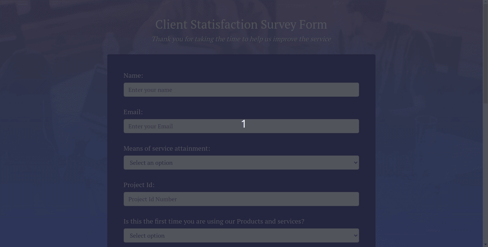

[![LinkedIn][linkedin-shield]][linkedin-url]

<h1 align="center">Client Satisfaction Survey Form</h1>

## Description
This is Simple Client Satisfaction Survey Form created using HTML,CSS,JS.
- Do Visit : https://client-survey.netlify.app/
- Topics
  - html5, js, css3

### Preview

<!-- MARKDOWN LINKS & IMAGES -->
<!-- https://www.markdownguide.org/basic-syntax/#reference-style-links -->
[linkedin-shield]: https://img.shields.io/badge/-LinkedIn-black.svg?style=for-the-badge&logo=linkedin&colorB=555
[linkedin-url]: https://www.linkedin.com/in/shyam-bodke/
